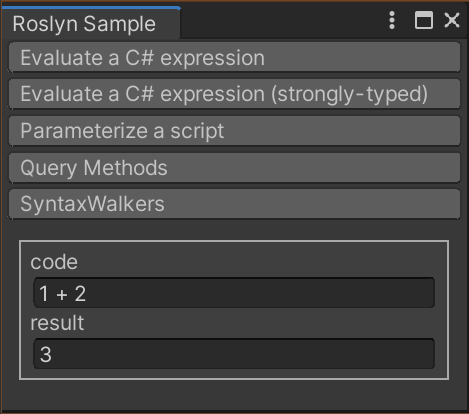

# Unity Roslyn Sample

## Requirements

- Unity2020.3.18f1

## Samples

- Evaluate a C# expression
- Evaluate a C# expression (strongly-typed)
- Parameterize a script
- Query Methods
- SyntaxWalkers

see also

- https://docs.unity3d.com/Packages/com.unity.code-analysis@latest/
- https://github.com/dotnet/roslyn/wiki/Scripting-API-Samples
- https://github.com/dotnet/roslyn/wiki/Getting-Started-C%23-Syntax-Analysis
